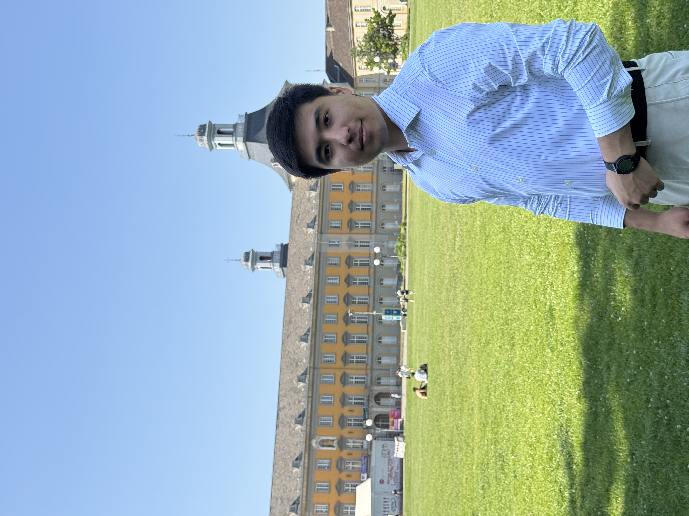

::: {.about-wrap}
:::{.about-photo}
{fig-alt="Shokhrukhkhon Nishonkulov" width="320"}
:::
:::{.about-text}

# About

My name is **Shokhrukhkhon Nishonkulov**. For me, economics is less a subject than a way of thinking, a discipline that shapes how I frame problems, structure ideas, and try to make sense of the world.

My path began at Kokand University in Uzbekistan, where I earned my undergraduate degree in Economics. It was there that a passing curiosity about models and data grew into a lasting commitment to careful, structured research. I learned early that good work is not about complexity for its own sake, but about clarity: asking precise questions and answering them honestly.

That commitment took me to the University of Bonn, where I completed a Master of Science in Economics. My work there centered on econometrics,particularly high-dimensional methods and causal inference. I studied the finite-sample behavior of the Double LASSO estimator through extensive Monte Carlo simulations, drawn less by whether a method works in theory than by how it holds up in practice, where data are imperfect, assumptions are stretched, and real decisions depend on reliable inference.

Today I bring that same approach to policy. I work as a Leading Specialist at the Institute of Macroeconomic and Regional Studies under the Cabinet of Ministers of Uzbekistan, where rigorous quantitative analysis meets questions that matter for the country's development. This is the connection I have always cared about most, between careful method and real-world problems.

My broader interests include applied econometrics, institutional economics, public finance, and the design of research tools that make complex methods transparent and reproducible. Outside formal research, I like to build things, a research workflow, a website, a startup idea. I have led and taken part in international startup competitions, building projects from scratch with small teams under tight constraints. Those experiences taught me how to move from an idea to execution, how to make decisions under uncertainty, and how to stay persistent when things do not work the first time.

At the core of everything is a simple principle: think clearly, work seriously, and connect theory with the problems that matter. I am drawn to complex questions, but I believe the way through them is straightforward, think carefully, test honestly, and build patiently.

:::
:::
