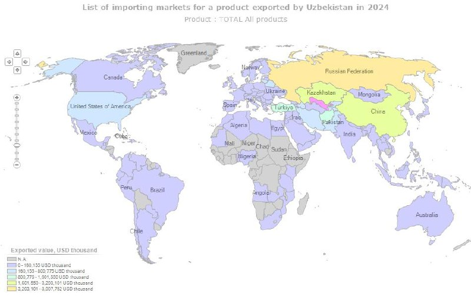

````{=html}
<div class="tg-post">
<div class="tg-media tg-media-1"></div>
<div class="tg-text">O'zbekiston o'tkan yili eng ko'p Rossiya, Xitoy va Qozog'iston mamlakatlariga o'z mahsulotlarini eksport qilgan ekan.<br/><br/>🇷🇺Rossiyaga eng ko'p eksport qilingan mahsulot 959,149 ming Aqsh dollari qiymatidagi Trikotaj yoki trikotajdan tikilgan kiyim-kechak buyumlari va aksessuarlari.<br/><br/>🇨🇳Xitoyga esa 791,426 ming Aqsh dollari qiymatidagi Mis va undan tayyorlangan buyumlar.<br/><br/>🇰🇿Qo'shnimiz Qozog'istonga esa 482,907 ming Aqsh dollari qiymatidagi Avtomabil va ularning qisimlari va aksessuarlari eksport qilingan.<br/><br/>O'zbekiston umumiy eksport mahsulotlari bo'yicha:<br/><br/>Birinchi o'rinda 13,953,327 ming Aqsh dollari qiymati bilan Tabiiy yoki madaniy marvaridlar, qimmatbaho yoki yarim qimmatbaho toshlar, qimmatbaho metallar, qimmatbaho metallar bilan qoplangan metallar va ulardan tayyorlangan buyumlar; taqlid zargarlik buyumlari; tanga. <br/><br/>Ikkinchi o'rinda esa 2,313,238 Aqsh dollari qiymat bilan Paxta va paxta mahsulotlari.<br/><br/>Uchinchi o'rinda esa 1,845,657 Aqsh dollari qiymat bilan Mineral yoqilg'ilar, mineral moylar va ularni distillash mahsulotlari; bitumli moddalar; mineral mumlar.<br/><br/><a href="https://t.me/Iqtisodchiroq" rel="noopener" target="_blank">@Iqtisodchiroq</a></div>
<p class="tg-source"><a href="https://t.me/iqtisodchiroq/23" target="_blank" rel="noopener">View on Telegram →</a></p>
</div>
````
