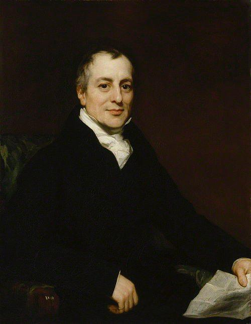

````{=html}
<div class="tg-post">
<div class="tg-media tg-media-1"></div>
<div class="tg-text"><b>David Ricardo 19-asr boshlarida ilgari surgan Comparative Advantage — ya’ni Nisbiy Ustunlik nazariyasi</b><br/><br/><i>Nega ayrim davlatlar o'zlarida ishlab chiqarilishi mumkin bo'lgan mahsulotni chetdan sotib oladi? Yoki boshqa mamlakatlar bilan savdo qilishdan nima foyda ko'radi?</i><br/><br/>Bu savollarga David Rikardo tomonidan ilgari surilgan nisbiy ustunlik nazariyasi javob beradi:<br/><br/>Har bir davlat o‘zida eng samarali va kam xarajatli mahsulotni ishlab chiqarishga ixtisoslashsa, qolgan mahsulotlarni esa boshqa davlatlardan sotib olsa, hamma yutadi!<br/><br/>Masalan:<br/>Angliya mato ishlab chiqarishda Germaniyaga nisbatan ustun bo‘lsa,<br/>Germaniya esa vino ishlab chiqarishda ustun bo‘lsa,<br/>U holda har ikkisi o'zlariga nisbatan ustun bo‘lgan sohaga ixtisoslashib, qolganini bir-biridan sotib olgani ma'qul.<br/><br/>Natijada:<br/>Ishlab chiqarish samaradorligi oshadi<br/>Resurslardan to‘liq va foydali foydalaniladi<br/>Ikkala davlat ham iqtisodiy yutadi!<br/><br/><b>Nisbiy ustunlik </b>– bu har doim ko‘proq va arzonroq ishlab chiqarish emas, nisbatan samaraliroq sohada ustun bo‘lish demakdir.<br/><br/><blockquote>📝Xulosa: Har bir davlat kuchli bo‘lgan sohada ishlab chiqarishni ko‘paytirsa va boshqalardan kerakli mahsulotni olib tursa — hamma yutadi. Bu Ricardoning sodda, ammo chuqur iqtisodiy haqiqatidir.</blockquote><br/><br/><a href="https://t.me/Iqtisodchiroq" rel="noopener" target="_blank">@Iqtisodchiroq</a></div>
<p class="tg-source"><a href="https://t.me/iqtisodchiroq/24" target="_blank" rel="noopener">View on Telegram →</a></p>
</div>
````
