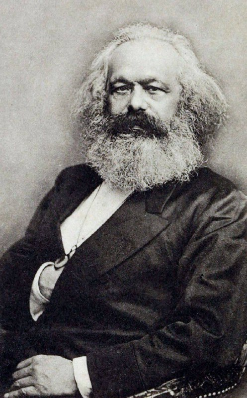

````{=html}
<div class="tg-post">
<div class="tg-media tg-media-2"></div>
<div class="tg-text"><div>Karl Marks. Germaniyaning buyuk iqtisodchi va faylasufi<br/><br/>Karl Marks (1818–1883) Germaniyalik iqtisodchi, faylasuf va siyosiy nazariyotchi bo‘lib, zamonaviy iqtisodiy fikr va sotsializm g‘oyalariga ulkan ta’sir ko‘rsatgan shaxsdir.<br/><br/>Uning eng mashhur asarlari “Kapital” va “Kommunistik manifest” bo‘lib, ularda kapitalizm tizimi, sinfiy kurash, mehnatning qiymati va iqtisodiy tengsizlikning sabablari chuqur tahlil qilingan.<br/><br/>Marksga ko‘ra, jamiyatning rivoji ishlab chiqarish vositalariga egalik qiluvchi sinf (burjuaziya) va mehnatkash sinf (proletariat) o‘rtasidagi ziddiyat orqali harakatlanadi.<br/><br/>Uning g‘oyalari keyinchalik ko‘plab iqtisodiy va siyosiy yo‘nalishlarga, shu jumladan marksizm va sotsialistik harakatlarga asos bo‘ldi.<br/><br/>Bugungi kunda ham Marksning asarlari iqtisodchilar, siyosatchilar va talabalar uchun chuqur tahlil manbai bo‘lib qolmoqda.</div></div>
<p class="tg-source"><a href="https://t.me/iqtisodchiroq/31" target="_blank" rel="noopener">View on Telegram →</a></p>
</div>
````
